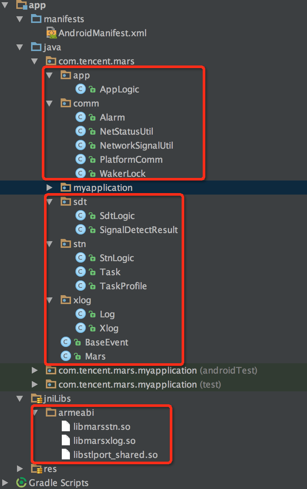

## Mars

[](https://github.com/Tencent/mars/blob/master/LICENSE)
[](https://github.com/Tencent/mars/releases)
[](https://github.com/Tencent/mars/pulls)
[](https://github.com/Tencent/mars/wiki)


Mars is a meta-model of component-based software that works on cross platform. It is  developed by the WeChat Mobile DevTeam.


* comm：common library, including socket, thread, messagequeue, coroutine, etc.
* xlog：a reliable log component with high-performance
* SDT： a network detection component
* STN： a signalling network component, the major part of Mars

##Getting started
Choose [Android](#android) or [iOS/OS X](#apple)

###<a name="android">[Android](https://github.com/Tencent/mars/wiki/Mars-Android-%E6%8E%A5%E5%85%A5%E6%8C%87%E5%8D%97)</a>

You can [compile by yourself](#local_compile) or use [gradle](#gradle). [gradle](#gradle) is highly recommended.

#### <a name="local_compile">compile by yourself</a>

```python
python build_android.py
```
If "static libs" is chosen, the "shared libs" can be attained by executing ```cd mars_android_sdk;ndk-build -B -j```

Copy the libs and Java files into your project:


Add permissions by adding the following lines to your AndroidManifest.xml

```java
<uses-permission android:name="android.permission.WRITE_EXTERNAL_STORAGE"/>
<uses-permission android:name="android.permission.ACCESS_WIFI_STATE" />
<uses-permission android:name="android.permission.ACCESS_NETWORK_STATE" />
<uses-permission android:name="android.permission.READ_PHONE_STATE"/>
<uses-permission android:name="android.permission.INTERNET" />
```

####<a name="gradle">gradle</a>
Add dependencies by adding the following lines to your app/build.gradle.

```xml
dependencies {
    compile 'com.tencent.mars:mars-core:1.0.0'
}
```

Initialize Xlog when your app starts. Remember to use an exclusive folder to save the log files, no other files is acceptable in the folder since they would be removed by the cleansing function in Xlog automatically.

```java
System.loadLibrary("stlport_shared");
System.loadLibrary("marsxlog");

final String SDCARD = Environment.getExternalStorageDirectory().getAbsolutePath();
final String logPath = SDCARD + "/marssample/log";

//init xlog
if (BuildConfig.DEBUG) {
    Xlog.appenderOpen(Xlog.LEVEL_DEBUG, Xlog.AppednerModeAsync, "", logPath, "MarsSample");
    Xlog.setConsoleLogOpen(true);

} else {
    Xlog.appenderOpen(Xlog.LEVEL_INFO, Xlog.AppednerModeAsync, "", logPath, "MarsSample");
    Xlog.setConsoleLogOpen(false);
}

Log.setLogImp(new Xlog());
```

Uninitialize xlog when your app exits


```java
Log.appenderClose();
```

Initialize STN before you use it

```java
// set callback
AppLogic.setCallBack(stub);
StnLogic.setCallBack(stub);
SdtLogic.setCallBack(stub);

// Initialize the Mars PlatformComm
Mars.init(getApplicationContext(), new Handler(Looper.getMainLooper()));

// Initialize the Mars
StnLogic.setLonglinkSvrAddr(profile.longLinkHost(), profile.longLinkPorts());
StnLogic.setShortlinkSvrAddr(profile.shortLinkPort());
StnLogic.setClientVersion(profile.productID());
Mars.onCreate(true);

StnLogic.makesureLongLinkConnected();
```
Firstly, you should call the setCalBack interface, and secondly, the Mars.init. Then, to initialize the Mars, there is to need to strictly follow the orders of the four commands. Finally, after Mars are initialized, the makesureLongLinkConnect can be called.


If you want to destory STN or exit your app:

```java
Mars.onDestroy();
```

When the state (background or foreground) of application  is changed:

```java
BaseEvent.onForeground(boolean);
```

###<a name="apple">[iOS/OS X](https://github.com/Tencent/mars/wiki/Mars-iOS%EF%BC%8FOS-X-%E6%8E%A5%E5%85%A5%E6%8C%87%E5%8D%97)</a>
Compile

```
python build_apple.py
```

Add mars.framework as a dependency of your project.


Initialize Xlog when your app starts. Remember to use an exclusive folder to save the log files, no other files is acceptable in the folder since they would be removed by the cleansing function in Xlog automatically.

```cpp
NSString* logPath = [[NSSearchPathForDirectoriesInDomains(NSDocumentDirectory, NSUserDomainMask, YES) objectAtIndex:0] stringByAppendingString:@"/log"];

// set do not backup for logpath
const char* attrName = "com.apple.MobileBackup";
u_int8_t attrValue = 1;
setxattr([logPath UTF8String], attrName, &attrValue, sizeof(attrValue), 0, 0);

// init xlog
#if DEBUG
xlogger_SetLevel(kLevelDebug);
appender_set_console_log(true);
#else
xlogger_SetLevel(kLevelInfo);
appender_set_console_log(false);
#endif
appender_open(kAppednerAsync, [logPath UTF8String], "Test");
```

Uninitialize xlog using  function "applicationWillTerminate"


```cpp
appender_close();
```

Initialize STN before you use it:

```objc
- (void)setCallBack {
    mars::stn::SetCallback(mars::stn::StnCallBack::Instance());
    mars::app::SetCallback(mars::app::AppCallBack::Instance());
}

- (void) createMars {
    mars::baseevent::OnCreate();
}

- (void)setClientVersion:(UInt32)clientVersion {
    mars::stn::SetClientVersion(clientVersion);
}

- (void)setShortLinkDebugIP:(NSString *)IP port:(const unsigned short)port {
    std::string ipAddress([IP UTF8String]);
    mars::stn::SetShortlinkSvrAddr(port, ipAddress);
}

- (void)setShortLinkPort:(const unsigned short)port {
    mars::stn::SetShortlinkSvrAddr(port);
}

- (void)setLongLinkAddress:(NSString *)string port:(const unsigned short)port debugIP:(NSString *)IP {
    std::string ipAddress([string UTF8String]);
    std::string debugIP([IP UTF8String]);
    std::vector<uint16_t> ports;
    ports.push_back(port);
    mars::stn::SetLonglinkSvrAddr(ipAddress,ports,debugIP);
}

- (void)setLongLinkAddress:(NSString *)string port:(const unsigned short)port {
    std::string ipAddress([string UTF8String]);
    std::vector<uint16_t> ports;
    ports.push_back(port);
    mars::stn::SetLonglinkSvrAddr(ipAddress,ports);
}

- (void)makesureLongLinkConnect {
    mars::stn::MakesureLonglinkConnected();
}
```
Firstly, you should call the setCalBack interface, and secondly, the Mars.init. Then, to initialize the Mars, there is to need to strictly follow the orders of the four commands. Finally, after Mars are initialized, the makesureLongLinkConnect can be called.

If you want to destory STN or exit application:

```objc
- (void)destoryMars {
    mars::baseevent::OnDestroy();
}
``` 

When the App's state of background or forground is changed:

```objc
- (void)reportEvent_OnForground:(BOOL)isForground {
    mars::baseevent::OnForeground(isForground);
}
```

Network change

```objc
- (void)reportEvent_OnNetworkChange {
    mars::baseevent::OnNetworkChange();
}
```

## Support
Any problem?

1. Learn more from [tinker-sample-android](https://github.com/Tencent/mars).
2. Read the [source code](https://github.com/Tencent/mars/tree/master).
3. Read the [wiki](https://github.com/Tencent/mars/wiki) or [FAQ](https://github.com/Tencent/mars/wiki/Mars-%E5%B8%B8%E8%A7%81%E9%97%AE%E9%A2%98) for help.
4. Contact us for help.

## Contributing
For more information about contributing issues or pull requests, see our [Mars Contributing Guide](https://github.com/Tencent/mars/blob/master/CONTRIBUTING.md).

## License
Mars is under the MIT license. See the [LICENSE](https://github.com/Tencent/mars/blob/master/LICENSE) file for details.


